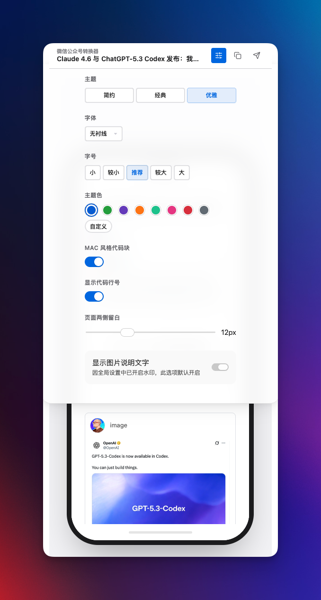
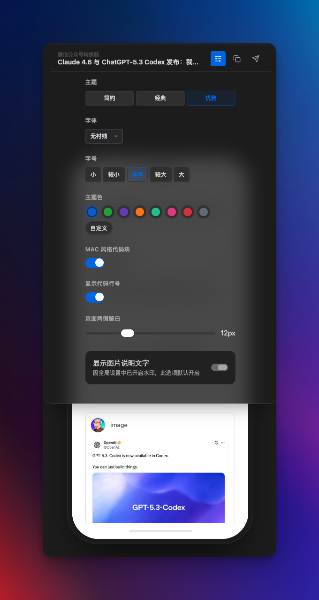
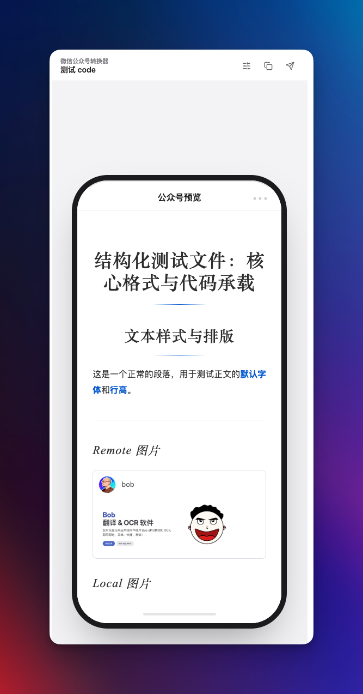
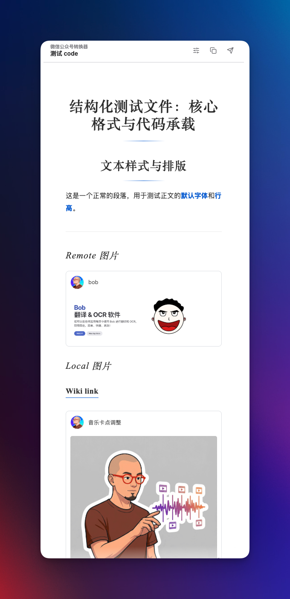

# 📝 微信公众号排版转换器 (WeChat Converter)

**让技术写作回归优雅与纯粹。**

一款专为 Obsidian 打造的微信公众号排版增强插件。它不仅仅是一个转换工具，更是您内容创作流中的"数字化妆师"。我们解决了 Obsidian 到微信公众号排版的"最后一公里"问题，让您专注于内容创作，无需为繁琐的格式调整而分心。

只需一键，即可将您的 Markdown 笔记转换为符合微信生态美学、阅读体验极佳的 HTML，无论是代码块、引用、列表还是本地图片，都能完美呈现。


> 本项目基于开源项目 [ai-writing-plugins](https://github.com/Ceeon/ai-writing-plugins) 进行深度重构与迭代开发。我们致力于打造 Obsidian 生态中体验最好的公众号排版工具。


## 💡 核心升级点 (Key Highlights)

相较于原版，我们**重写了核心渲染逻辑**并新增了大量实用功能，旨在实现真正的**"所见即所得"**：

1.  **➗ 完美支持数学公式 (Math Support) ⭐ v2.1 新增**
    - **LaTeX 全面支持**：直接书写 `$E=mc^2$` 或 `$$...$$`，所见即所得。
    - **纯矢量 SVG 渲染**：采用独家无缓存技术，将公式转为独立的 SVG 矢量图，无论放大多少倍都清晰锐利。
    - **抗清洗**：完美抵抗微信公众号的样式清洗，不再出现乱码或被吞掉的情况。

    <p align="center">
      
    </p>

2.  **🚀 一键同步到微信草稿箱 (v2.2 增强)**
    - **极速并发上传**：图片上传速度提升 300%，支持多线程并发处理，大图文章秒传。
    - **智能重试机制**：自动处理网络抖动与 Token 过期，全程零人工干预，稳如泰山。
    - **实时进度反馈**：新增精确的上传进度条 (e.g., "3/12")，让等待不再焦虑。
    - **安全防重**：严格的幂等性设计，杜绝因网络超时产生的重复草稿。
    - **告别复制粘贴**：直接将文章同步到微信公众号后台草稿箱，图片自动上传。
    - **智能封面处理**：如果你的文档头部信息（frontmatter）里写了 `cover`，会优先用它做封面；没写就自动用正文第一张图，也可以手动换图。
    - **智能摘要辅助**：如果 frontmatter 里写了 `excerpt`，会优先用它；没写就自动截取前 45 个字，也可以手动改。
    - **同步后自动清理（可选）**：发送成功后，可以自动删除你在设置里指定的目录（默认关闭）。
    - **目录支持变量**：清理目录支持 `{{note}}`，会自动替换成当前文档名，例如 `published/{{note}}_img`。
    - **可回收**：支持优先移动到系统回收站，误删可恢复。
    - **多账号管理**：支持最多 5 个公众号账号配置，快速切换同步。
    - **Cloudflare 代理支持**：解决 IP 白名单频繁变化问题，[查看部署指南](#-代理设置解决-ip-白名单问题)。

    <p align="center">
      
    </p>

3.  **🎛 全新可视化设置面板 (Settings Panel)**
    - 告别繁琐的代码修改！我们内置了直观的设置面板，让您可以实时调整字体、字号、主题色等参数，一切尽在掌握。

    <table>
      <tr>
        <th align="center">浅色模式</th>
        <th align="center">深色模式</th>
      </tr>
      <tr>
        <td align="center"></td>
        <td align="center"></td>
      </tr>
    </table>

4.  **🎨 三大专家级主题 (Premade Themes)**
    - 内置 **简约 (Simple)**、**经典 (Classic)**、**优雅 (Elegant)** 三款精心设计的主题，覆盖从技术博客到人文随笔的各种场景。

5.  **🖼️ 强大的本地图片支持 (Local Image Support)**
    - **打破图床限制**：完美支持 Obsidian 的本地图片引用（包括 `![[Wiki Link]]` 和 ``）。
    - **头像上传**：支持直接上传本地图片作为作者头像，插件会自动转码为 Base64。
    - **强大的本地图片支持**：无论是相对路径、绝对路径还是 WikiLink，都能自动识别并压缩。
    - **GIF 动图支持**：针对 GIF 格式特别优化，自动绕过压缩流程，完美保留完整动画帧。
    - **温馨提示**：建议图片（尤其是 GIF）保持在 10MB 以内，以获得最佳的处理速度和公众号兼容性。超过 10MB 时插件会弹出提醒。

6.  **⚡️ 实时渲染预览 (Live Preview)**
    - 右侧预览区实现了**毫秒级响应**的实时渲染。您在左侧 Markdown 编辑的每一个字符，都会即时反馈在右侧的公众号预览视图中。
    - **📱 双模预览 (Dual Mode Preview)** ⭐ v2.2 新增
        - **手机仿真模式 (默认)**：提供逼真的 iPhone X 边框与刘海屏效果，支持深色模式适配，还原最真实的读者视角。
        - **经典全宽模式**：在设置中一键切换回无边框全屏预览，利用屏幕每一寸空间。
    - **↕️ 双向同步滚动 (Bidirectional Sync)**：无论是在左侧编辑还是右侧浏览，另一侧都会如影随形，精准对齐。

    <table>
      <tr>
        <th align="center">手机仿真模式</th>
        <th align="center">经典全宽模式</th>
      </tr>
      <tr>
        <td align="center"></td>
        <td align="center"></td>
      </tr>
    </table>

7.  **💻 Mac 风格代码块与样式还原**
    - 重新设计了代码块样式，支持 macOS 窗口风格及行号显示。
    - **1:1 完美还原**：我们在 Obsidian 预览区看到的样式（包括间距、颜色、边框、阴影），复制到微信后台后将**分毫不差**。

    <p align="center">
      
    </p>

## 🧭 渲染管线阶段说明

为降低重构风险，当前采用分阶段迁移策略：

- **Legacy 渲染管线（默认）**
  - 当前稳定生产路径。
- **实验渲染管线（Phase 1）**
  - 仍复用现有 `AppleStyleConverter`，并增加安全预处理/后处理。
  - 目标是先把“渲染入口解耦 + 风险可回退”落地，不在本阶段承诺完整 Obsidian 原生三件套替换。
  - 已知会有少量有意识差异（例如：清理不安全 raw HTML 图片、修复 `**加粗**`在特定混排下的显示问题）。
- **Phase 2（后续）**
  - 才会逐步替换为 Obsidian 原生渲染能力，并补充对应端到端回归。
  - 新增“零差异门禁（Phase 2）”：实验渲染输出会与 Legacy 输出做字节级对比，不一致则自动回退 Legacy。

在插件设置里开启“实验渲染管线（Phase 1）”时，建议同时开启“原生失败时回退 Legacy”，以保证日常可用性。

## 🚀 安装

1. 从 [GitHub Releases](https://github.com/DavidLam-oss/obsidian-wechat-converter/releases) 下载最新的 `obsidian-wechat-converter.zip` 插件包。
2. 解压并将其中的文件夹放入 Obsidian vault 的 `.obsidian/plugins/` 目录中。
   > 最终路径应为：`.../.obsidian/plugins/obsidian-wechat-converter/`
3. 确保文件夹内包含 `main.js`, `manifest.json`, `styles.css` 以及 `lib/` 和 `themes/` 文件夹。
4. 重启 Obsidian 或在设置中刷新插件列表，并启用插件。

## 📖 使用方法

1. **唤起插件**
   - 点击 Obsidian 左侧边栏的 🪄 图标 (WeChat Converter)。
   - 或使用命令面板 (`Cmd/Ctrl + P`) 搜索并执行 "Open Wechat Converter"。

2. **预览与调整**
   - 插件会自动加载当前激活的笔记内容。
   - 在右侧面板中，您可以实时预览排版效果。

3. **一键复制**
   - 确认预览效果满意后，点击底部的 **[📋 复制到公众号]** 按钮。
   - 提示"已复制"后，直接在微信公众号后台编辑器中 `Ctrl/Cmd + V` 粘贴即可。

4. **一键同步到微信草稿箱** ⭐ 新功能
   - 先在插件设置里填好公众号账号（AppID / AppSecret）。
   - 点击 **[🚀 一键同步]**，选择账号后即可发送。
   - 默认值读取规则：
     - 摘要优先读 `excerpt`
     - 封面优先读 `cover`
     - `cover_dir` 用于同步成功后的“自动清理目录”判断，不作为封面图来源
     - 如果没有，就自动回退到插件默认逻辑（摘要自动截取、封面取正文首图）
   - 你在弹窗里手动上传封面、手动改摘要，始终优先于自动值。
   - 发送成功后，文章会出现在公众号后台草稿箱。

### 同步后自动清理（可选）

- 入口：插件设置 → 高级设置
- 默认是关闭的。
- 只有“发送到微信草稿箱成功”后，才会触发清理。
- 清理的是你在设置里填的目录（删目录，不是删单个文件）。
- 目录支持 `{{note}}`，会自动替换成当前文档名。
- 清理目录请填写 vault 内相对路径（不要填 `/Users/...` 或 `C:\\...` 这类绝对路径）。
- 清理成功后，如果文档里的 `cover` / `cover_dir` 指向这个已删除目录，插件会自动清空这些失效字段。
- 建议开启“使用系统回收站”，这样删错也能找回。
- 示例：`published/{{note}}_img`  
  如果当前文档名是 `post`，实际删除目录是 `published/post_img`。

## 🔧 代理设置（解决 IP 白名单问题）

微信公众号 API 需要 IP 白名单验证。如果你使用 VPN 或动态 IP，可以通过 Cloudflare Worker 代理解决。

### 部署步骤

1. **创建 Cloudflare Worker**
   - 登录 [Cloudflare Dashboard](https://dash.cloudflare.com/)
   - 左侧菜单选择 **Workers & Pages** → **Create Application** → **Create Worker**
   - 命名（如 `wechat-proxy`）并点击 **Deploy**

2. **编辑 Worker 代码**

   点击 **Edit code**，替换为以下代码：

   ```javascript
   export default {
     async fetch(request, env) {
       const corsHeaders = {
         'Access-Control-Allow-Origin': '*',
         'Access-Control-Allow-Methods': 'POST, OPTIONS',
         'Access-Control-Allow-Headers': 'Content-Type',
       };
   
       // 处理 CORS 预检请求
       if (request.method === 'OPTIONS') {
         return new Response(null, { headers: corsHeaders });
       }
   
       if (request.method !== 'POST') {
         return new Response('Method Not Allowed', { status: 405, headers: corsHeaders });
       }
   
       try {
         const body = await request.json();
         const { url, method = 'GET', data, fileData, fileName, mimeType, fieldName } = body;
         
         // === Debug Logging ===
         console.log('Received URL:', url);
         
         // 安全校验：只允许访问微信 API
         if (!url || !url.startsWith('https://api.weixin.qq.com/')) {
           const errorMsg = `Invalid URL. Expected: starts with https://api.weixin.qq.com/. FLASH: Received [${typeof url}]: ${url}`;
           return new Response(JSON.stringify({ error: errorMsg, receivedBody: body }), { status: 400, headers: corsHeaders });
         }
   
         let response;
         if (method === 'UPLOAD' && fileData) {
           // 文件上传处理：Base64 -> Binary -> FormData
           const binary = atob(fileData);
           const bytes = new Uint8Array(binary.length);
           for (let i = 0; i < binary.length; i++) bytes[i] = binary.charCodeAt(i);
           
           const formData = new FormData();
           formData.append(fieldName || 'media', new Blob([bytes], { type: mimeType }), fileName);
           response = await fetch(url, { method: 'POST', body: formData });
         } else {
           // 普通 JSON 请求
           const opts = { method, headers: { 'Content-Type': 'application/json' } };
           if (method !== 'GET' && data) opts.body = JSON.stringify(data);
           response = await fetch(url, opts);
         }
   
         const result = await response.json();
         return new Response(JSON.stringify(result), {
           headers: { ...corsHeaders, 'Content-Type': 'application/json' }
         });
       } catch (error) {
         return new Response(JSON.stringify({ error: `Server Error: ${error.message}`, stack: error.stack }), { status: 500, headers: corsHeaders });
       }
     }
   };
   ```


3. **配置微信 IP 白名单**

   将 Cloudflare 出口 IP 添加到微信公众号白名单（[官方 IP 列表](https://www.cloudflare.com/ips/)）：

   ```
   173.245.48.0/20, 103.21.244.0/22, 103.22.200.0/22, 103.31.4.0/22
   141.101.64.0/18, 108.162.192.0/18, 190.93.240.0/20, 188.114.96.0/20
   197.234.240.0/22, 198.41.128.0/17, 162.158.0.0/15, 104.16.0.0/13
   104.24.0.0/14, 172.64.0.0/13, 131.0.72.0/22
   ```

4. **插件配置**

   在插件设置 → **高级设置** → **API 代理地址** 中填入你的 Worker URL：
   ```
   https://wechat-proxy.your-account.workers.dev
   ```


## 🤝 贡献 (Contributing)

欢迎提交 Issue 或 Pull Request！

1. Fork 本仓库。
2. 创建您的特性分支 (`git checkout -b feature/AmazingFeature`)。
3. 提交您的更改 (`git commit -m 'Add some AmazingFeature'`)。
4. 推送到分支 (`git push origin feature/AmazingFeature`)。
5. 开启一个 Pull Request。

## 📄 许可证

本项目采用 [MIT License](LICENSE) 开源。

## 👨‍💻 作者

**林小卫很行 (DavidLam)**

一名热衷于提升生产力的开发者与内容创作者。
如果您在使用过程中有任何问题、建议或发现了 Bug，欢迎随时在 GitHub Issue 区留言反馈。相信工具的力量，让创作更自由。
